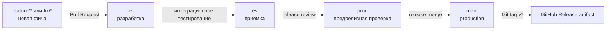

# Веточная модель и поставка

## Схема

- `main` — production-код. Прямые push запрещены.
- `prod` — кандидат на выпуск; после проверки сливается в `main`.
- `test` — приемочное и интеграционное тестирование.
- `dev` — общая ветка разработки и интеграции фич.
- `feature/*`, `fix/*`, `hotfix/*` — короткоживущие рабочие ветки.

## Правила работы

1. Новая задача начинается от актуальной `dev`:
   `git switch dev && git pull && git switch -c feature/<name>`.
2. Feature-ветка сначала тестируется локально и через CI.
3. После review открывается PR `feature/* -> dev`.
4. Стабильное состояние `dev` продвигается PR `dev -> test`.
5. После приемки создается PR `test -> prod` и выполняется release-проверка.
6. После проверки `prod` создается PR `prod -> main` и тег `vX.Y.Z`.
7. После merge рабочая feature-ветка удаляется.

Все изменения проходят через PR. Прямые push в `dev`, `test`, `prod` и `main` не используются.

## Branch protection

Для `dev`, `test`, `prod` и `main` рекомендуется включить:

- обязательный Pull Request;
- обязательный успешный CI;
- запрет force push и удаления ветки.

Дополнительно для `test`, `prod` и `main`:

- обязательное обновление ветки перед merge;
- ручной review;
- для `main` — минимум один approval и обязательный PostgreSQL smoke test.

Branch protection настраивается в GitHub; локальный Git не применяет эти серверные правила.

## CI/CD

`.github/workflows/ci.yml` запускается для Pull Request и push в `dev`, `test`, `prod` и `main`:

- Python syntax и unit/contract tests;
- Rust `cargo check` и `cargo test`;
- React production build;
- PostgreSQL 16 smoke test с применением migrations.

`.github/workflows/release.yml` запускается по тегу `v*`, созданному после merge `prod -> main`.
Автоматический runtime deploy пока не настроен.
