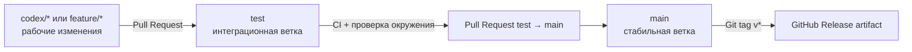

# Веточная модель и поставка

## Ветки

- `main` — только проверенный стабильный код. Прямые push запрещаются branch protection.
- `test` — интеграция функциональных веток и проверка сборки целиком.
- `codex/*`, `feature/*`, `fix/*` — короткоживущие рабочие ветки.
- `hotfix/*` — исправления от `main`; после выпуска изменения также возвращаются в `test`.

## Правила слияния

### Рабочая ветка → test

1. Ветка создаётся от актуальной `test`.
2. Открывается Pull Request в `test`.
3. Обязателен успешный workflow `CI`.
4. Предпочтительный метод — squash merge.
5. После слияния рабочая ветка удаляется.

### test → main

1. Открывается отдельный release Pull Request.
2. Обязателен успешный `CI`.
3. Проверяется PostgreSQL migration smoke test и release artifact.
4. Слияние выполняется только после ручного review.
5. Для выпуска создаётся тег `vX.Y.Z`.

## Рекомендуемая branch protection в GitHub

Для `test`:

- require pull request;
- require status check `CI / quality`;
- require branches to be up to date;
- block force pushes and deletion.

Для `main`:

- require pull request;
- require минимум одного approval;
- require status checks `CI / quality` и `CI / postgres-smoke`;
- require conversation resolution;
- block force pushes and deletion;
- restrict direct pushes.

Branch protection настраивается в GitHub после публикации ветки `test`; локальный Git не может принудительно применить эти серверные правила.

## CI/CD

`.github/workflows/ci.yml` запускается для Pull Request и push в `test`/`main`:

- Python syntax и unit/contract tests;
- Rust `cargo check` и `cargo test`;
- React production build;
- PostgreSQL 16 smoke test с применением migrations.

`.github/workflows/release.yml` запускается по тегу `v*`:

- повторно собирает React UI;
- формирует архив исходников и UI build;
- публикует artifact workflow;
- создаёт GitHub Release с архивом.

Это continuous delivery артефакта. Автоматический runtime deploy не настроен, потому что в репозитории не определена целевая платформа: VM, Kubernetes, Docker host или облачный сервис.
