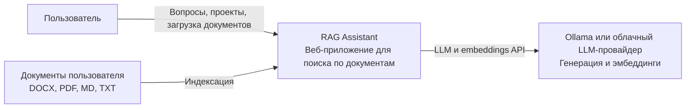
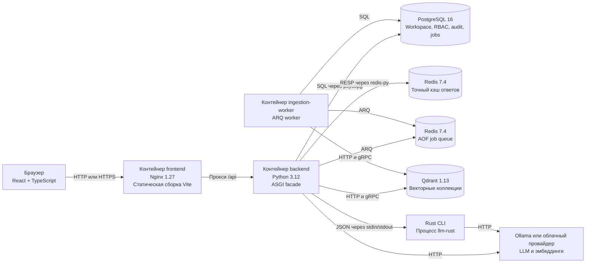
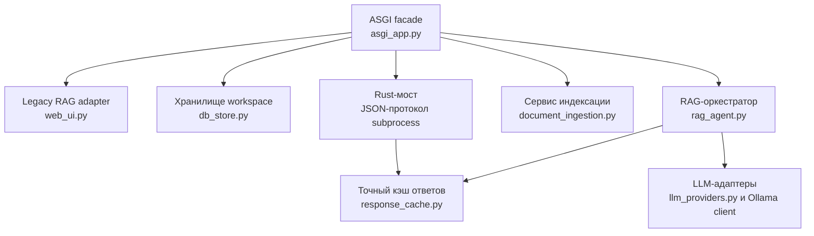
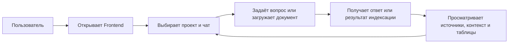
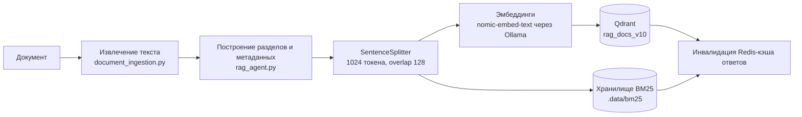
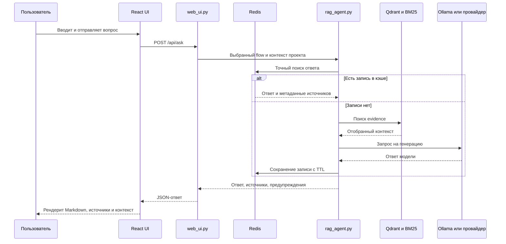
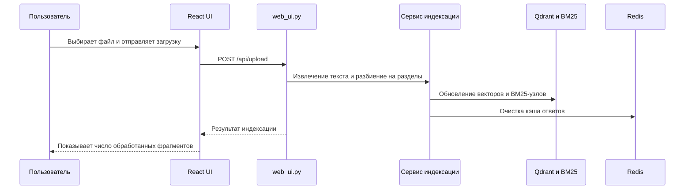
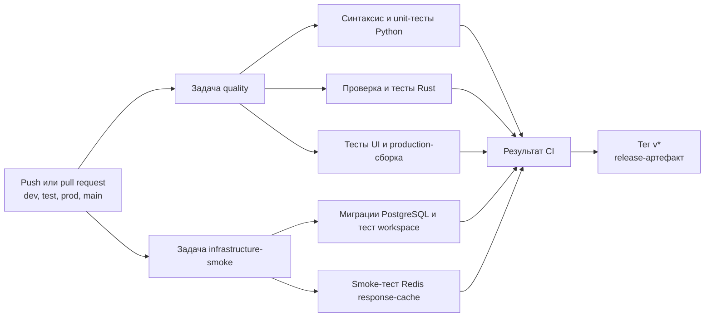

# Архитектура RAG Assistant

Документ описывает фактическую архитектуру Docker-стека. C3-схемы разделяют контекст системы, контейнеры и компоненты backend-сервера. Пользовательские сценарии, технические pipeline и CI вынесены отдельно, чтобы не смешивать уровни абстракции.

## Принципы

- Python-индекс является основным источником доказательств для Web UI.
- Rust-индекс дополняет Python evidence в режимах `rust` и `hybrid`, но не заменяет его.
- Кэш ответов точный, а не семантический: похожие вопросы по нормативным документам могут требовать разных ответов.
- PostgreSQL хранит состояние продукта, RBAC/ABAC, audit и историю чатов. Redis разделён на временный кэш ответов и устойчивую очередь ingestion-задач.

## C1. Контекст системы



| Элемент | Назначение | Технологии |
| --- | --- | --- |
| Пользователь | Работает с чатами, проектами и базой знаний | Браузер |
| RAG Assistant | Ищет evidence и формирует проверяемые ответы | React, Python, Rust, PostgreSQL, Qdrant, Redis |
| LLM-провайдер | Формирует ответы и эмбеддинги | Ollama, OpenAI-compatible API, GigaChat, YandexGPT |
| Документы | Источник знаний для поиска | DOCX, PDF, Markdown, text |

## C2. Контейнеры



| Контейнер или процесс | Ответственность | Постоянное состояние |
| --- | --- | --- |
| `frontend` | Отдаёт React UI и проксирует API-вызовы | Нет |
| `backend` | ASGI API, RBAC/ABAC, SSE, telemetry и compatibility facade для RAG | Bind-mount `.data/` |
| `ingestion-worker` | Выполнение и отмена долгих ingestion-задач через ARQ | Bind-mount `.data/`, PostgreSQL jobs |
| `postgres` | Проекты, чаты, RBAC/ABAC, audit, jobs и миграции | Том `postgres_data` |
| `qdrant` | Коллекции векторов `rag_docs_v10` и `knowledge_base` | `.data/qdrant/` |
| `response-cache` | Точный кэш сгенерированных ответов | Нет, намеренно временный |
| `job-queue` | Устойчивая Redis/ARQ доставка ingestion-задач | Том `queue_data`, AOF/noeviction |
| `llm-rust` | Rust CLI поиска и генерации, запускаемый backend | Qdrant и Ollama; опциональный CLI-том |
| Ollama | Локальные модели и модель эмбеддингов, опциональный Compose-профиль | Том `ollama_data` при включённом профиле |

`response-cache` доступен только во внутренней сети Compose и не публикует порт на хост.

### Доступные интерфейсы

| Интерфейс | Ссылка | Назначение |
| --- | --- | --- |
| Frontend | [http://127.0.0.1:5173](http://127.0.0.1:5173) | Пользовательский интерфейс чатов, проектов и базы знаний |
| Swagger UI | [http://127.0.0.1:8080/docs](http://127.0.0.1:8080/docs) | Интерактивная документация backend API |
| OpenAPI | [http://127.0.0.1:8080/api/openapi.json](http://127.0.0.1:8080/api/openapi.json) | Машиночитаемая спецификация API |
| Backend API | [http://127.0.0.1:8080/api/](http://127.0.0.1:8080/api/) | HTTP API для frontend и интеграций |
| Qdrant Dashboard | [http://127.0.0.1:6333/dashboard](http://127.0.0.1:6333/dashboard) | Просмотр коллекций и состояния Qdrant |
| Qdrant HTTP API | [http://127.0.0.1:6333](http://127.0.0.1:6333) | Векторный API Qdrant |

Redis и PostgreSQL не имеют веб-интерфейса и не публикуют административные порты для браузера.

## C3. Компоненты backend



| Компонент | Ответственность | Основные зависимости |
| --- | --- | --- |
| `asgi_app.py` | HTTP API, RBAC/ABAC, SSE, jobs, metrics и telemetry | FastAPI, OpenTelemetry, ARQ |
| `web_ui.py` | Legacy RAG-маршруты, flow, промт с контекстом проекта и payload ответа | Compatibility adapter, subprocess-мост |
| `db_store.py` | Транзакции, миграции и CRUD workspace | `psycopg 3`, PostgreSQL |
| `rag_agent.py` | Python-поиск, выбор evidence, генерация и валидация | LlamaIndex, Qdrant, BM25, Ollama или provider adapter |
| `document_ingestion.py` | Извлечение текста и метаданных документа | XML parser, Mammoth, PDF readers |
| `response_cache.py` | Точный кэш с TTL и безопасной деградацией при недоступности Redis | `redis-py`, Redis |
| `llm_providers.py` | Адаптеры OpenAI-compatible и региональных провайдеров | `requests`, HTTP API провайдеров |
| Rust-мост | Вызывает `llm-rust` JSON-командами | `subprocess.run`, Rust CLI |

## Пользовательский baseline



Baseline описывает действия пользователя. Внутренние контейнеры и алгоритмы не показаны здесь намеренно: они описаны на уровнях C2/C3 и в технических pipeline ниже.

## Pipeline поиска и генерации

### Индексация



### Сценарий: пользователь задаёт вопрос



### Сценарий: пользователь загружает документ



### Режимы обработки

| Режим | Доказательства | Генерация | Область кэша |
| --- | --- | --- | --- |
| `python` | Python Qdrant и BM25, выбор PRISM | Python LLM adapter | Полный ответ и генерация |
| `rust` | Python-first fusion с Rust retrieval | Rust CLI и Ollama | Точная Rust-генерация |
| `hybrid` | Python-first fusion с Rust retrieval | Python LLM adapter | Точная Python-генерация |

Python и Rust используют разные физические индексы. Fusion резервирует большинство слотов для Python evidence и использует Rust evidence как дополнение. Это исключает использование устаревшей Rust-коллекции как единственного источника фактов.

## Владение данными и политика кэша

| Хранилище | Данные | Хранение и инвалидация |
| --- | --- | --- |
| PostgreSQL | Проекты, чаты, сообщения, настройки workspace | Постоянный Docker-том; миграции применяет backend |
| Qdrant | Эмбеддинги и метаданные Python- и Rust-коллекций | `.data/qdrant/`; обновляется при индексации |
| Хранилище BM25 | Узлы Python retrieval | `.data/bm25/`; перестраивается или обновляется при индексации |
| Redis | Хэш ключа, ответ модели, метаданные источника `file`, `section`, `score` | TTL 7 дней, 128 МБ, `allkeys-lru`, без записи на диск |
| `.data/state`, `.data/uploads`, `.data/cache` | Выбор провайдера, flow, uploads и локальные артефакты | Единый runtime-каталог; его согласованный снимок хранится в Git |

Redis не хранит API-ключи, полные промты, вопросы, историю чатов и текстовые превью источников. Обновление корпуса, явная очистка кэша, смена провайдера/модели и смена flow инвалидируют кэш ответов.

## Pipeline доставки



Release workflow упаковывает backend, Rust-исходники, Compose-файлы, миграции, архитектуру и production-сборку Vite. В артефакт входит `response_cache.py`, поэтому реализация runtime-кэша сохраняется в релизе.

## Команды эксплуатации

```powershell
# Запуск полного стека
docker compose up --build -d

# Проверка состояния сервисов
docker compose ps

# Метрики и логи кэша
docker compose logs -f response-cache
docker compose exec response-cache redis-cli INFO memory

# Очистка кэша сгенерированных ответов через API приложения
Invoke-RestMethod -Method Post http://127.0.0.1:8080/api/cache/clear
```

## Карта исходного кода

- UI: `ui/src/App.tsx`, `ui/src/styles.css`
- API и маршрутизация: `web_ui.py`
- Постоянное состояние workspace: `db_store.py`, `migrations/`
- Python RAG: `rag_agent.py`, `document_ingestion.py`, `docx_parser.py`
- Кэш ответов: `response_cache.py`
- Адаптеры провайдеров: `llm_providers.py`
- Rust CLI: `src/main.rs`, `src/agent.rs`, `src/retrieval.rs`, `src/llm.rs`
- CI и релиз: `.github/workflows/ci.yml`, `.github/workflows/release.yml`
