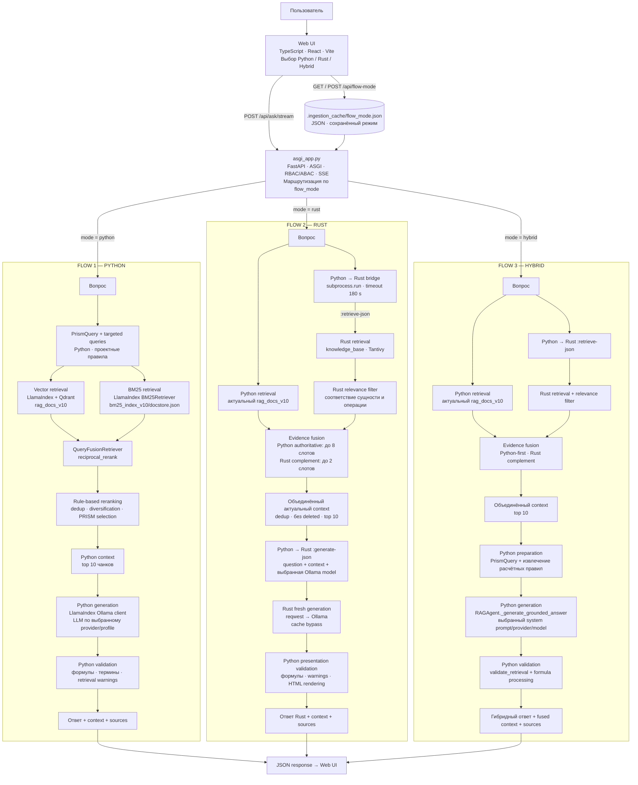
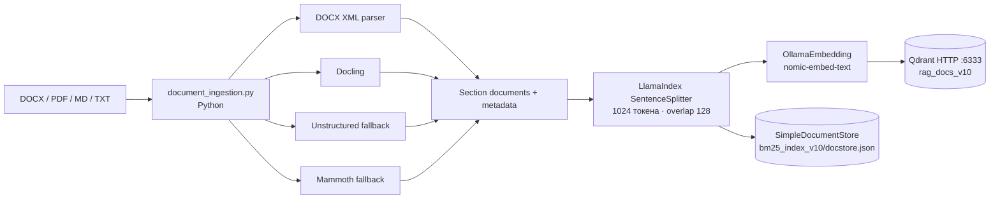
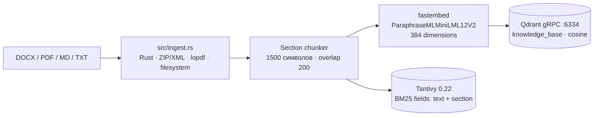
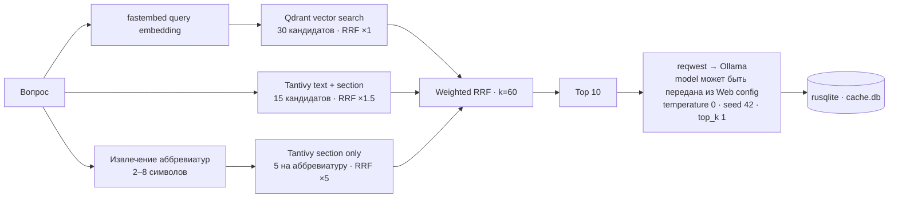

# Фактическая архитектура RAG-проекта

> Состояние исходного кода после добавления переключателя режимов. Web backend объединяет Python- и Rust-реализации и предоставляет три маршрута обработки вопроса: `python`, `rust`, `hybrid`.

## Production-контур: ASGI, доступ, очередь и telemetry

Внешний backend — `asgi_app.py` на FastAPI/ASGI. `python web_ui.py` и
`python -m uvicorn asgi_app:app` запускают тот же защищённый сервис. Старый
`Handler` не слушает порт: он временно вызывается через `legacy_adapter.py`,
поэтому прежние API-контракты работают, но больше не обходят authorization,
audit и request telemetry.

```text
Microfrontend → Nginx → FastAPI → RBAC + ABAC → RAG / Qdrant / LLM
                                 ↘ PostgreSQL (identity, policies, audit, jobs)
                                  ↘ Redis/ARQ → ingestion worker → subprocess
```

### Identity, RBAC и ABAC

`security.py` преобразует dev или OIDC identity в `Principal`. OIDC проверяет
подпись JWT по JWKS, issuer, audience и сроки токена; mapping ролей,
permissions и атрибутов задаётся `RAG_OIDC_*` переменными. При запуске
идемпотентно создаётся bootstrap superadmin с subject из
`BOOTSTRAP_SUPERADMIN_SUBJECT`; пароль локального пользователя не хранится.

PostgreSQL содержит principals, roles, permissions, связи ролей, ABAC policies,
audit events и jobs. Миграция `0001_security_audit_jobs` применяется командой
`alembic upgrade head`. Проверка `authorize()` сначала применяет superadmin и
RBAC, затем ABAC: явный `deny` policy имеет приоритет над role permission.
Policy поддерживает `all`, `any`, `not`, `eq`, `ne`, `in`, `contains`, `exists`
над `principal.*`, `resource.*` и `context.*`. Администрирование доступно через
`POST /api/admin/policies` и `POST /api/admin/principals/{subject}/roles` и
требует `rag.admin`/superadmin.

### Очередь и streaming

`POST /api/jobs/ingestion` создаёт persistent job в PostgreSQL и ставит его в
Redis/ARQ. `python -m ingestion_worker` выполняет ingestion в отдельном
subprocess: `GET /api/jobs/{id}` возвращает state/progress/result, а
`DELETE /api/jobs/{id}` ставит отмену и завершает subprocess. Это важно: отмена
не оставляет блокирующий ingestion в API worker.

`POST /api/ask/stream` — SSE endpoint. Он немедленно отдаёт `started` и
heartbeats, передаёт LLM deltas как `delta`, затем итоговый metadata event
`completed`; microfrontend использует его по умолчанию. Cache и детерминированные
ответы отдаются одним delta, Rust generation пока возвращает один final delta.

### Observability и безопасность данных

Доступны `/healthz`, `/readyz` и `/metrics`; response содержит `X-Request-ID`
и `X-Trace-ID`. OTLP spans покрывают HTTP, authorization, cache, vector/BM25,
fusion/rerank, Rust bridge, LLM generation и ingestion. JSON technical/audit
events пишутся в stdout и PostgreSQL; prompt, ответ, токен, document text,
subject и document ID не становятся Prometheus labels или span attributes.
Retention audit настраивается `RAG_AUDIT_RETENTION_DAYS` (default 90 в worker,
production Compose override — 365 дней).

Полный production stack, secrets, reverse proxy/CORS/TLS guidance, Collector,
Prometheus, Tempo, Loki, Grafana dashboards и alerts описаны в
[`deploy/README.md`](deploy/README.md). Быстрый запуск: скопировать `.env.example`
и secret examples, затем `docker compose --env-file .env up -d`.

### Проверки

Python runtime проекта — **3.12**: актуальный LlamaIndex/Qdrant adapter не
поддерживает Python 3.14. После `py -3.12 -m venv .venv` и
`.venv\Scripts\python -m pip install -r requirements.txt` запускаются unit и
contract тесты. `test_rag_integration.py` намеренно требует
`RAG_LIVE_E2E=1`, отдельный Qdrant, collection/BM25/cache и Ollama с моделями
`qwen2.5:14b` и `nomic-embed-text`; он проверяет ingest → retrieval → LLM и
отдельно фильтрацию prompt-injection fixture. Не направляйте этот тест на
`localhost:6333` другого проекта.

## Runtime-схема: три режима рядом



## Семантика режимов

| Режим | Retrieval | Генерация | Финальная обработка |
|---|---|---|---|
| `python` | Python: LlamaIndex, Qdrant `rag_docs_v10`, BM25Retriever, проектный reranking | Python `RAGAgent` через настроенный LLM provider | Python: формулы, источники, validation warnings, HTML |
| `rust` | Python retrieval + отфильтрованный Rust retrieval; Python evidence приоритетен | Rust `generate_from_context()` по объединённому актуальному context | Python: формулы, источники, validation warnings, HTML |
| `hybrid` | Тот же Python-first fusion двух индексов | Python `_generate_grounded_answer()` по объединённому context | Python: PRISM, расчётные правила, validation warnings, HTML |

## Переключение режима

React-компонент предлагает три значения:

```text
python  — Python retrieval + Python generation
rust    — Python/Rust evidence fusion + Rust generation
hybrid  — Python/Rust evidence fusion + Python generation/validation
```

Web UI читает режим через `GET /api/flow-mode` и изменяет через `POST /api/flow-mode`. Backend принимает только `python`, `rust` и `hybrid`. Выбор сохраняется в `.ingestion_cache/flow_mode.json`, поэтому восстанавливается после перезапуска UI/backend. Если режим действительно изменился, перед сохранением нового значения очищается общая таблица `answer_cache` в `cache.db`.

## Python → Rust bridge

Интеграция реализована не через FFI и не через отдельный сетевой сервис. Python запускает Rust CLI как дочерний процесс:

```text
готовый binary: target/debug/llm-rust[.exe]
fallback:       cargo run --quiet
stdin:          :<command> <question>\n:exit\n
stdout:         одна строка JSON
timeout:        180 секунд
```

Машинные команды Rust:

| Команда | Метод Rust | Результат | Использование |
|---|---|---|---|
| `:retrieve-json` | `Agent::retrieve_evidence()` | Массив `RetrievalEvidence` | Hybrid flow и debug context |
| `:ask-json` | `Agent::ask()` | `AgentResponse` | Полный Rust flow |
| `:generate-json` | `Agent::generate_from_context()` | Новый ответ по переданным `question`, `context` и `model` | Текущий Web Rust flow |

Команда `:ask-json` остаётся доступна в CLI, но текущий Web Rust flow её не использует. Backend получает Rust evidence через `:retrieve-json`, объединяет его с актуальным Python evidence и вызывает `:generate-json`. Этот путь намеренно обходит Rust answer cache и всегда генерирует ответ по переданному context.

## Объединение evidence и защита от рассинхронизации индексов

Python- и Rust-индексы физически раздельны и могут содержать разные версии корпуса. Web backend поэтому не считает Rust-индекс единственным источником даже в режиме `rust`:

Зафиксированный дефект возник именно из-за рассинхронизации: Python retrieval работал по актуальному `ruk.docx`, а Rust `knowledge_base` содержал старые чанки из `D:\LLM Rust\r12.docx`. Из-за нерелевантного Rust-контекста Hybrid корректно отказывался формировать неподтверждённый ответ. Исправление выполнено на уровне orchestration и не требует считать два индекса синхронными.

1. Выполняется retrieval в актуальном Python-индексе.
2. Выполняется Rust `:retrieve-json`.
3. Rust evidence фильтруется по сущности и запрошенной операции.
4. `fuse_contexts()` сначала резервирует до `top_k - 2` позиций для Python evidence, затем дополняет Rust evidence.
5. Удаляются точные дубликаты и evidence со статусом `deleted`.
6. Итог ограничивается `TOP_K = 10`.

При наличии десяти Python-кандидатов стандартное распределение — 8 Python + 2 Rust. Поле `flow_origin` показывает происхождение каждого фрагмента.

Для запроса о создании параметра Python reranker и procedural selection приоритетно отбирают разделы:

- `Создание параметра`;
- `Вкладка «Общее»`;
- `Вкладка «Принадлежность»`;
- `Панель инструментов`.

Соседние сценарии получают штрафы или исключаются: создание документов, назначение формул, добавление версии, удаление, макросы, копирование и редактирование параметров.

## Python pipeline

### Индексация



### Запрос

- Vector candidates: `12`.
- BM25 candidates: `12`.
- Fusion: `QueryFusionRetriever(mode="reciprocal_rerank", num_queries=1)`.
- Расширенный candidate pool: `max(top_k × 5, 40)`; при `top_k=10` — 50.
- После fusion применяются проектный reranking, deduplication, diversification и PRISM evidence selection.
- Финальный контекст: `top 10`.
- Answer cache: SQLite `cache.db`, версия ключа задаётся `CACHE_VERSION`.

## Rust pipeline

### Индексация



### Запрос



Параметры Rust Ollama generation для текущего запроса:

```text
think       = false
num_ctx     = 8192
num_predict = 768
temperature = 0.0
seed        = 42
top_k       = 1
top_p       = 1.0
```

`qwen3.5:9b` передаётся из сохранённой Web-конфигурации в `:generate-json`. Thinking отключён на уровне Rust Ollama request. В Python для `qwen3.5:9b` также задан отдельный профиль: `context_window=8192`, `thinking=false`, `num_predict=768`, timeout 120 секунд. Для остальных Ollama-моделей действует Python default profile: окно 16384, `num_predict=1024`, timeout 180 секунд.

## Web-операции, не переключаемые режимом

Текущий selector маршрутизирует обработку вопроса и debug retrieval. Он не маршрутизирует ingestion:

- `/api/load` всегда вызывает Python `RAGAgent.ingest()`;
- `/api/upload` всегда индексирует через Python `RAGAgent`;
- `/api/cache/clear` очищает общую таблицу `answer_cache` через Python connection;
- при фактическом переключении режима эта же таблица очищается автоматически;
- debug в `python` показывает Python retrieval, а в `rust` и `hybrid` — объединённый Python/Rust evidence.

Следствие: документы, загруженные только через Web UI, попадают в Python-индекс. Rust-индекс `knowledge_base` по-прежнему заполняется Rust-командой `:load` отдельно, но его устаревшее или нерелевантное содержимое больше не является единственным context для режимов `rust` и `hybrid`: Web backend объединяет его с актуальным Python evidence.

## Проверки

Повторно выполнено по текущему workspace:

| Проверка | Команда | Результат |
|---|---|---|
| Python routing + PRISM tests | `.venv\\Scripts\\python.exe -m unittest test_flow_modes.py test_prism.py` | 11/11 успешно |
| Rust compile check | `cargo check` | успешно |
| Rust tests | `cargo test` | успешно; в crate сейчас 0 unit tests |
| React production build | `npm run build` в `ui/` | успешно; TypeScript + Vite build |

`test_flow_modes.py` проверяет контракт маршрутизации с mock-объектами: Python flow, fused evidence в Rust/Hybrid, приоритет Python-индекса 8/2, отсечение нерелевантного Rust evidence и очистку кэша при переключении. Это unit/contract-тест, а не запуск реальных Qdrant и Ollama.

## Источники в коде

- Выбор режима и React UI: `ui/src/App.tsx`, `ui/src/styles.css`
- Backend router и subprocess bridge: `web_ui.py`
- Python RAG: `rag_agent.py`
- Python ingestion: `document_ingestion.py`, `docx_parser.py`
- Rust JSON CLI: `src/main.rs`
- Rust orchestration и DTO: `src/agent.rs`
- Rust ingestion: `src/ingest.rs`
- Rust embeddings: `src/embed.rs`
- Rust vector store: `src/store.rs`
- Rust BM25 и retrieval: `src/bm25.rs`, `src/retrieval.rs`
- Rust LLM client: `src/llm.rs`
- Routing tests: `test_flow_modes.py`
